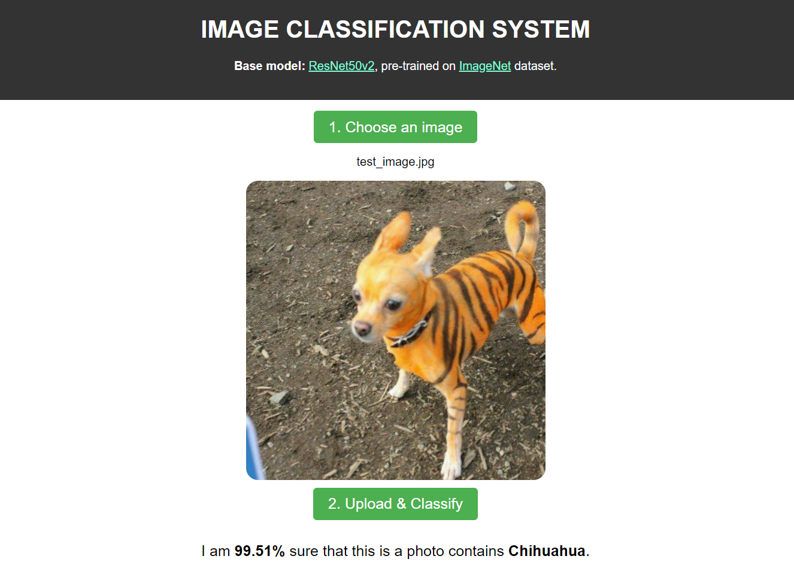

# Image Classification Web App

This repository contains a very simple web application that allows users to upload an image and classify it using a pre-trained [ResNet50v2](https://www.tensorflow.org/api_docs/python/tf/keras/applications/resnet_v2/ResNet50V2) model. The application is built using the [Flask](https://flask.palletsprojects.com/en/2.3.x/) web framework and is designed to run locally on your machine.

## Installation

Before you can run the application, please ensure that you have [Python](https://www.python.org/) (3.8 or higher) installed on your PC.

Then, you have to install the necessary dependencies. You can do this by running the following command:

```
pip install -r requirements.txt
```

This will install Flask, TensorFlow, Keras, Pillow, and any other required packages.

## Usage

First of all, to generate `resnet.h5` pre-trained model, run the following command:
```
cd models/
python resnet.py
```

To start the application, run the following command:

```
cd ../server/
python server.py
```

This will start the Flask development server on your local machine. You can then access the application by opening your web browser and navigating to `http://localhost:5000`.

To use the application, follow these steps:

1. Click the "Choose an Image" button to select an image from your computer.
2. Click the "Upload & Classify" button to upload the image to the server.
3. Wait for the image to be processed. This may take a few seconds.
4. Once the image has been processed, the predicted result will be displayed on the screen.

## Demo


## License

This project is licensed under the MIT License - see the [LICENSE](LICENSE) file for details.

## Final Notes

**Thanks for going through this Repository! Have a nice day.**

Got any queries? Feel free to contact us via <a href = "mailto: baotin2402@gmail.com">E-mail</a>.